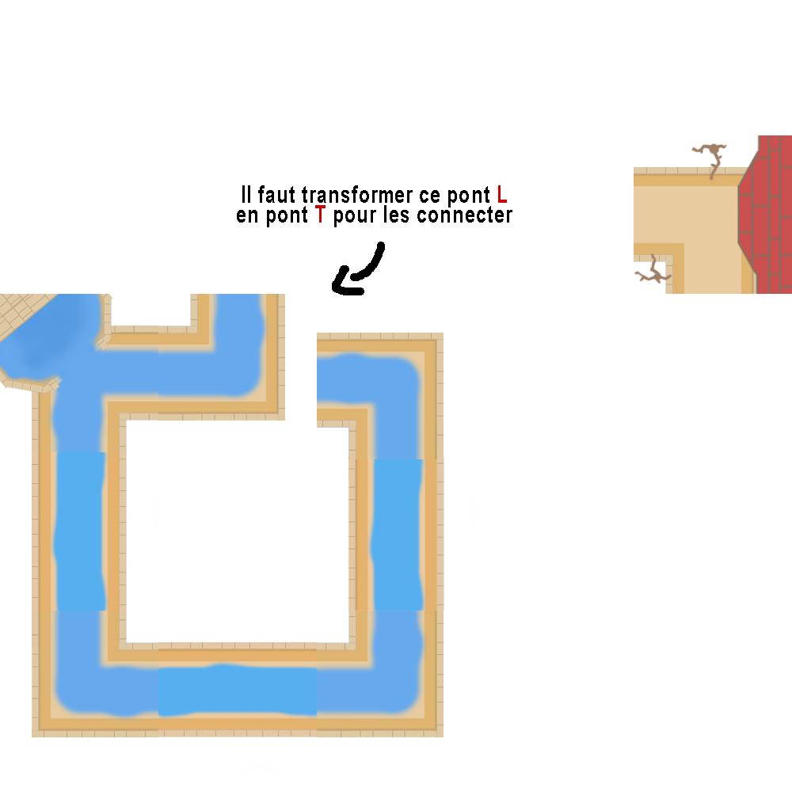
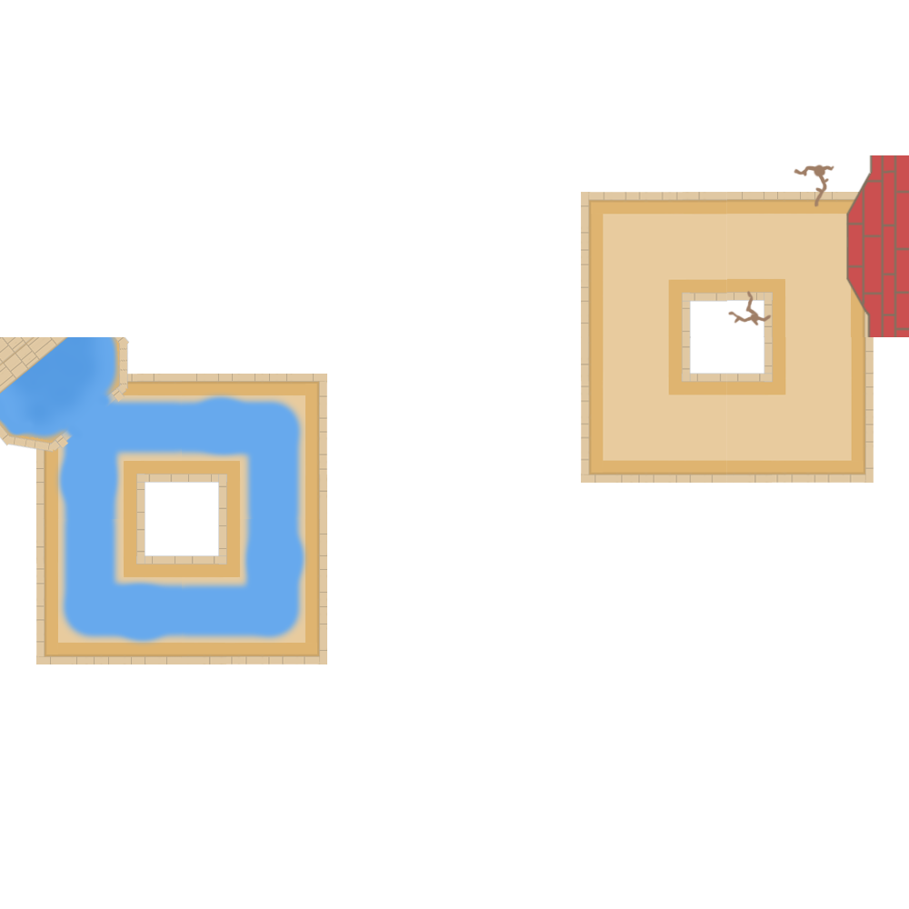
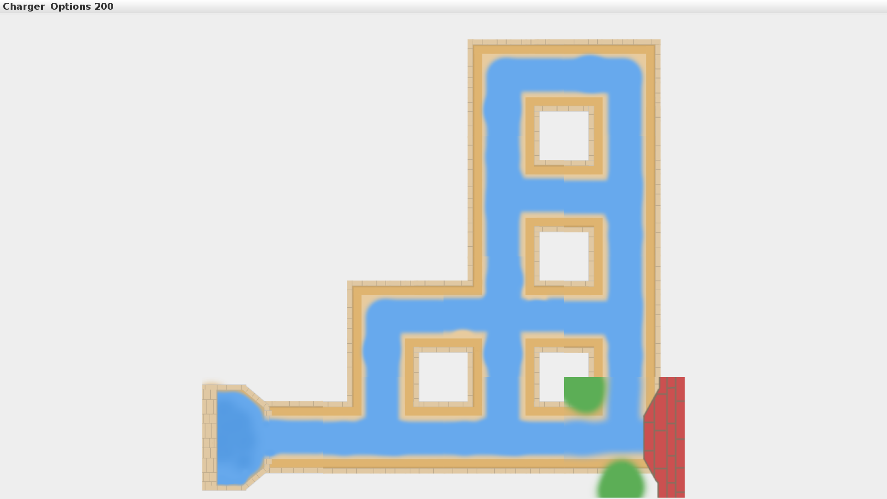
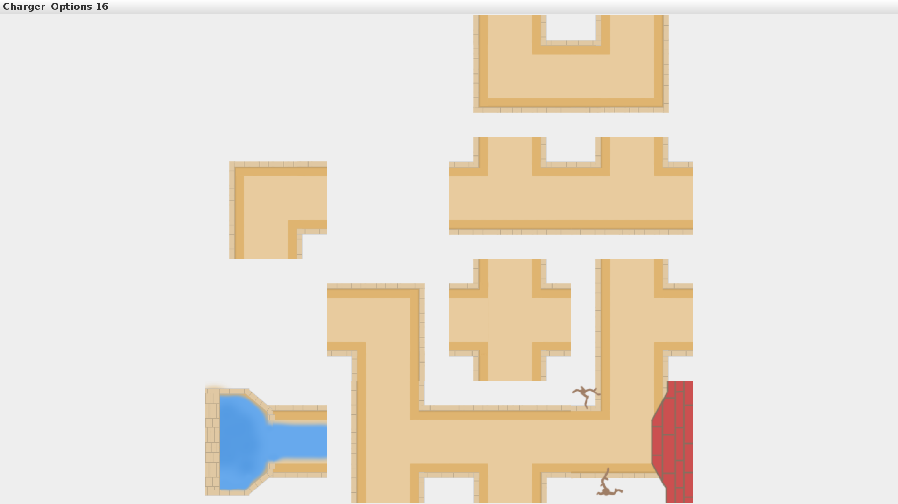

# Algorithme de génération de niveaux

## Les deux classes

Le générateur est séparé en deux classes. La classe GenNiveaux s'occupe du choix aléatoire du mode du jeu entre "compteur" et "fuite", et de la taille du niveau, entre 3 (la taille minimale d'un niveau, en dessous les niveaux n'ont aucuns intérêts) et 10 (une taille déja assez élevée, qui peut entrainer la génération de niveaux trés complexes).  
Le reste de la génération se passe dans la classe Plateau, qui créé le plateau d'un niveau en s'occupant de toutes les contraintes requises à la fabriquation d'un niveau.  

## Génération du plateau  

La classe Plateau s'occupe de la mise en place d'un plateau de jeu, et s'assure, qu'il est terminable, ainsi que des quelques fonctions annexes, telles que le calcul de la limite de coups ou de temps.  
L'algorithme s'articule autour de la fonction `genererChemin()`. On créé dans un premier temps un tableau de la taille choisie précédemment que l'on remplit de case nulle.  
Puis on place l'entrée et la sortie du jeu à des hauteurs aléatoires. La position sur l'axe X étant définie (0 pour l'entrée et taille du plateau moins 1 pour la sortie) il n'y a plus qu'a générer un nombre aléatoire pour l'axe Y.  
Les ponts d'entrées et de sorties peuvent être placés a n'importe quelle hauteur, et on vérifie bien qu'ils ne présentent pas de sortie en direction d'un mur et qu'ils soient bien orienté (les images de ces ponts n'étant pas symétriques, leur orientation est donc importante).  
Ensuite on appel `genererChemin()` sur le pont d'entrée.  

### La fonction genererChemin()  

La fonction `genererChemin()` est une fonction récursive qui s'appelle, si on a besoin de continuer le chemin (voir partie condition d'arret), sur toutes les sorties du pont qu'elle vient de générer.  
Ainsi, pour chaque sortie du pont passé en paramètre de la fonction, on à deux possibilités :  
- Si la case du plateau vers laquelle dirige une sortie du pont est vide :  
  On créé un nouveau pont aléatoire, qui a plus de chance de diriger vers la droite (vers la sortie) que vers la gauche (de revenir sur ses pas).  
Les essais nous on montrés qu'avoir deux chances sur trois de diriger plutôt vers la droite donnait les résultats les plus intéressants.  
- Sinon, la case du plateau vers lequelle la sortie dirige contient déja un pont :  
  Il faut donc que l'on forme une connexion entre ces deux ponts, pour former un passage, ou une boucle.  
  On doit donc rajouter une sortie au pont sur lequel on arrive; en changeant sa forme. Ainsi un pont en I ou en L, qui ne présentent que 2 sorties (déja connectées car l'appelle récursif est déja passé par ces sorties), doivent devenir des ponts en T.  
De la même manière, les ponts en T, qui présentent 3 sorties, doivent devenir des ponts en X (ou en + peu importe leur nom), et être connectés dans toutes les directions.  
C'est pourquoi on a les fonctions `shouldBeX()`, `shouldBeL()` et `shouldBeT()`, qui calculent les conditions pour savoir en quel pont le pont sur lequel on forme une nouvelle connexion doit être transformé.  
L'image suivante illustre un cas ou nous devons rajouter une sortie à un pont :  

Les fonctions `satisfaitSortiesPont()`, `lierPontWith()` et `verifMur()` permettent de vérifier les conditions de base de bon fonctionnement d'un niveau.  
- `verifMur()` permet de vérifier que les ponts ne dirigent pas en dehors des limites du plateau.   
- `lierPontWith()` permet de connecter deux ponts ensembles.  
- `satisfaitSortiesPont()` permet d'assurer que le nouveau pont est bien connectés avec ses voisins.

Condition d'arrêt :  
La récursion s'arrête quand on tombe sur une case non vide. On transfome le pont sur lequel on tombe, et on arrête cette partie de la récursion car le reste du chemin a déjà été traité par les appels récursifs précédents.  

L'algorithme génère le niveau dans une configuration de victoire, avec tous les ponts bien connectés et orientés et un chemin sans fuite.  
Il nous est donc très simple de vérifier si celui-ci est faisable. En effet, un simple appel a la fonction `isVictoire()` de Jeu nous permet de savoir si le niveau est faisable (et donc fait dans notre cas).  

Le fonctionnement de l'algortihme ne nous prouve pas que le niveau produit est faisable.  
Par exemple, le niveau suivant n'est pas faisable mais pourtant l'algorithme termine :  
  

C'est pourquoi notre algorithme vérifie la faisabilité du niveau avant d'effectuer la suite du programme. Si il détecte un niveau qui n'est pas faisable, il l'efface et recommence une nouvelle génération.  
Ce fonctionnement n'est pas parfait, mais permet d'assurer l'exportation de niveaux faisables.  
Etant donné qu'il existe un nombre (très) important de configuration faisable, et un nombre assez faible de configuration non-faisable, on est sur que la boucle while  de génération de niveau termine et entraine l'exportation d'un niveau faisable.  

A ce moment de l'algorithme, on est en capacité d'exporter le niveau, sous forme de solution avant de mélanger les pièces.  

## Calcul de la limite et de la difficulté  

Afin de rendre le niveau généré intérressant, on mélange les pièces et on en rajoute certaines inutiles.  
Chaque case vide à une chance sur trois d'accueillir un pont inutile, ils sont donc placés de façon totalement aléatoire, parfois isolés et (vraiment) inutiles, parfois au plus proche d'un chemin, et donc ajoutant de la difficulté au niveau.  
Chaque case contenant un pont est tourné, un nombre de coup choisi aléatoirement.  
Voici un niveau solution créer par le générateur de niveau :  
  
Et voici le même niveau tel qu'il serait exporté pour être jouable :  
  
  
Ces deux fonctions (`rotateAleaPont()` et `placerPontInutile()`) permettent aussi de calculer le nombre de coups pour le niveau, et sa difficulté.  
La limite du nombre de coup est calculée de la façon suivante : On compte le nombre de fois que l'on doit cliquer sur le pont pour atteindre la position de victoire, et on rajoute un coup par pont placé aléatoirement.  
Après plusieurs essais, c'est cette façon de compter qui semble donner un nombre de coups le plus interressant pour le joueur tout créannt un peu de difficulté sur certains niveaux.  
Pour le calcul de la limite en temps, on a considéré que chaque coup prenait 2 secondes, on multiplie donc par deux le nombre de coups calculé précédemment, et le transformons en seconde.  
Les niveaux avec fuite d'eau sont donc un peu plus simple que les niveaux avec compteur de coups d emanière générale, pour contre-balancer la "pression" du chronomètre.  

Finalement, on exprime la difficulté du niveau en fonction de sa taille et du nombre de coups pour le résoudre, et le générateur renvoit un nouveau plateau, qui peut être exporter dans le dossier niveau par la fonction `createNiveau()` de la classe GenNiveaux.  
