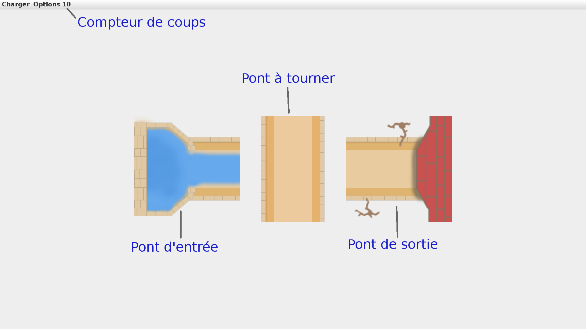

# Aquavias

Version d'Aquavias pour le projet d'informatique du semèstre 4.  
  
[GROUPE]  
Battaglini Nicolas - 21801244 - @Tireur2cables  
Barrault Victor - 21803922 - @Brrlt  
Sang David - 21804098 - @david  
Canto Justin - 21965056 - @Justin   
  
Sous la supervision de :  
Ines Klimann - @klimann  
Benjamin Lipp - @blipp  
  
# Comment Jouer
    
1.  Téléchargez ou clonez le projet dans un dossier.
2.  Placez vous dans ce dossier et tapez la commande `make` afin de compiler le projet.
3.  Utilisez la commande `java -jar aquavias.jar` pour lancer le Jeu.
4.  Vous arrivez sur le menu du Jeu. Cliquez sur `charger` puis sur le premier niveau afin de le lancer.
5.  Cliquez sur les ponts pour les faire tourner.
  

## But du Jeu
  
Il existe pour chaque niveau un pont d'entrée, pont spécial tout à gauche du niveau, et un pont de sortie, pont spécial tout à droite du niveau.  
Le but de chaque niveau est de créer un chemin entre le pont d'entrée et le pont de sortie ne contenant aucune fuite d'eau.  
La difficulté réside dans le nombre de coups ou le temps qui vous est impartit pour réussir votre mission  
  

  
  
  
mettre les autres choses ici.  
Le "pour les développeurs doit être à la fin"  
  
  
  
# Pour les développeurs
  
Aquavias possède une API afin de donner une certaine liberté de développement autour du jeu.
Si vous trouvez qu'il manque des fonctions dans l'API n'hésitez pas à ouvrir une issue sur le sujet!  
  
### Description de l'API
  
#### Classe Pont
  
`static Pont createPont(char forme, String spé)` : renvoit un pont de la forme passée en paramètre, si la forme demandée est `'O'` renvoit une forme aléatoire.  
Le paramètre spé vaut soit `null` pour un pont standard soit `"entree"` ou `"sortie"` pour un pont d'entrée ou sortie.  
  
`static char getRandomOrientation()` : renvoit un char correspondant à une orientation aléatoire entre les 4 utilisées par le jeu (`'N'`, `E`, `S`, `O`).  
  
`boolean[] reCalculSorties()` : renvoit un tableau de 4 booléens correspondants aux sorties du pont.  
Si reCalculSorties()[0] vaut `true` alors le pont possède une sortie vers le Nord. Ainsi de suite avec 1 = Est, 2 = Sud et 3 = Ouest.  
  
`static getCharNextOrientation(char c)` : renvoit l'orientation suivante après avoir tourné le pont.  
Par exemple si l'orientation passée en paramètre est `'N'` alors la fonction renvoit `'E'`. Permet de tourner un pont en l'utilisant avec `setCharOrientation()`.  
  
`char getCharForme()` : renvoit un char correspondant à la forme du pont, `'L'`, `I`, `T`, `X`.  
  
`void setCharOrientation(char orientation)` : met l'orientation du pont à la valeur passée en paramètre et met à jour les sorties du pont.  
  
`char getCharOrientation()` : renvoit un char correspondant à l'orientation actuelle du pont.  
  
`String getStringSpe()` : renvoit une string correspondant au paramètre spé du pont à savoir `null` pour un pont normal et `"entree"` ou `"sortie"` pour un pont d'entréé ou de sortie.  
  
`boolean isPontEntree()` : revoit `true` si le pont est un pont d'entrée et `false` sinon.  
  
`boolean isPontSortie()` : renvoit `true` si le pont est un pont de sortie et `false` sinon.  
  
`boolean isPontAccessibleFrom(char sortie)` : renvoit `true` si le pont est est accessible depuis la sortie passée en paramètre.  
Par exemple un pont en I orientation 'N' renverra `true` pour un appel à cette fonction avec `'N'` ou `'S'` en paramètre.  
  
`boolean isOrientationCorrecteEntreeSortie()` : renvoit `true` si le pont possède une orientation lui permettant d'être une entrée ou une sortie et `false`.  
Cette fonction devrait être utilisée seulement sur un pont aillant un paramètre spé égal à "entree" ou "sortie".  
  
#### Classe Jeu
  
`Jeu(int numNiveau, String mode)` : constructeur de `Jeu` permettant d'initialiser un objet Jeu avec les paramètres `numNiveau`, pour le numéro du niveau en cours.  
Et `mode`, pour le mode de jeu voulu, à savoir `"compteur"` ou `"fuite"`. A ce moment là le jeu n'a pas encore de plateau et beaucoup de fonctions ne sont pas utilisables.  
    
`static ArrayList<File> getArrayListNiveau()` : renvoit une ArrayList contenant chaque niveaux du dossier `resources/niveaux`.  
  
`void setPlateau(Pont[][] plateau)` : permet d'initialiser le paramètre `plateau` de l'objet Jeu, qui sera la matrice de Pont passée en paramètre.  
  
`void setLimite(int limite)` : permet d'initialiser le paramètre `limite` et grâce à celui-ci le paramètre `debit` qui dépendent du paramètre `mode` initialisé lors de la construction de l'objet.  
  
`void setDifficulte(String difficulte)` : permet d'initialiser le paramètre `difficulte` de l'objet. Devrait être soit `"Facile"`, `"Moyen"` ou `"Difficile"`.  
Cependant rien n'empêche de créer sa propre difficulté.  
  
`boolean isVictore()` : revoit `true` si le plateau actuel est en situation de victoire. C'est à dire que les ponts entrée et sortie sont relié sans aucune fuite entre eux.  
Renvoit `false` sinon.  
  
`void niveauToJSON(boolean isSave)` : permet d'exporter un niveau créer dans un fichier JSON.  
Si le paramètre `isSave` vaut `true` alors le niveau sera sauvegardé dans `resources/profil/niveauSauvegarde.json` et son numéro sera sauvegardé dans `resources/profil/numSauvegarde.json`.  
Sinon si le niveau actuel est en état de victoire alors le niveau sera sauvegardé comme une solution dans `resources/solutions/niveau[numNiveau].json`.  
Si le niveau n'est pas en état de victoire alors il sera sauvegardé dans `resources/niveaux/niveau[numNiveau].json` avec les autres niveaux jouables.  
  
### Comment utiliser l'API
  
Pour créer un projet utilisant l'API d'Aquavias vous pouvez imiter.
  