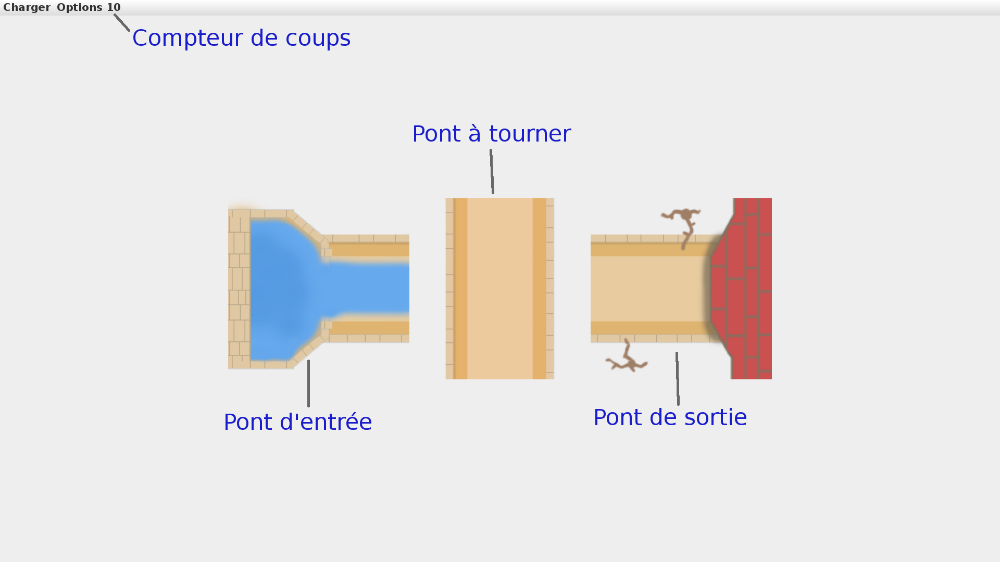

# Aquavias #

Version d'Aquavias pour le projet d'informatique du semestre 4.  
Le document explicatif pour le rendu du projet est le fichier [README.md](Rendu/README.md) dans le dossier `Rendu`.  

[GROUPE]  
Battaglini Nicolas - 21801244 - @Tireur2cables  
Barrault Victor - 21803922 - @Brrlt  
Sang David - 21804098 - @david  
Canto Justin - 21965056 - @Justin   

Sous la supervision de :  
Ines Klimann - @klimann  
Benjamin Lipp - @blipp  

# Comment Jouer

1.  Téléchargez ou clonez le projet dans un dossier.
2.  Placez vous dans ce dossier et tapez la commande `make` afin de compiler le projet.
3.  Utilisez la commande `java -jar aquavias.jar` pour lancer le Jeu.
4.  Vous arriverez normalement sur le tutoriel du jeu qui vous expliquera les subtilités du jeu.  

## But du Jeu

Il existe pour chaque niveau un pont d'entrée, pont spécial tout à gauche du niveau, et un pont de sortie, pont spécial tout à droite du niveau.  
Le but de chaque niveau est de créer un chemin entre le pont d'entrée et le pont de sortie ne contenant aucune fuite d'eau.  
La difficulté réside dans le nombre de coups ou le temps qui vous est impartit pour réussir votre mission.  
Voici un schéma explicatif de la vision que vous avez lorsque vous lancez un niveau :  

  
  
Il existe deux modes de jeu différents, le mode "compteur" et le mode "fuite d'eau". Le mode compteur donne une limite du nombre de rotations de pont. Le mode fuite d'eau entraine une limite en "temps", qui s'écoule de façon non-linéaire.  
Si le joueur arrive à la fin du compteur ou qu'il n'a plus d'eau dans son réservoir et que le niveau n'est pas gagné, il perd et doit recommencer le niveau.  
Dans le mode fuite d'eau, si une partie du chemin est complète et emmène de l'eau jusqu'a la sortie, alors le débit de fuite diminue, et le joueur a plus de temps pour continuer d'avancer.  
De même, si le joueur parvient à former une boucle dans le chemin, alors il n'y a plus de fuite, et le compteur se met en pose. Il peut donc avancer dans le niveau sans s'occuper du temps qu'il lui reste.  
  
## Fin du jeu
  
Le jeu se finit lorsque vous terminez le dernier niveau.  
A ce moment là vous débloquerez le `mode infini`. Le mode infini est un bouton qui se trouve sur la barre de menu quand vous êtes dans le menu principal.  
Ce bouton vous permet de générer automatiquement un nouveau niveau aléatoire.  
Vous pourrez utiliser autant que vous voulez ce bouton afin d'allonger votre expérience de jeu.  

## Génération aléatoire de niveaux  

L'explication de l'algorithme de génération de niveaux se trouve dans le fichier [README.md](GenNiveaux/README.md) dans le dossier `GenNiveaux`. Il forme un programme "à part" du jeu.  
Pour générer "manuellement" des niveaux supplémentaires, il vous suffit de taper la commande : `java -jar genNiveaux.jar N`, où N est le nombre de niveaux que vous voulez.  
Cette commande aura pour effet de créer le nombre de niveaux demandé. Ces niveaux seront immédiatement jouables apès redémarrage du jeu.  

# Pour les développeurs

Aquavias possède une API afin de donner une certaine liberté de développement autour du jeu.  
Si vous trouvez qu'il manque des fonctions dans l'API n'hésitez pas à ouvrir une issue sur le sujet!  

### Description de l'API

#### Classe Pont

`static Pont createPont(char forme, String spe)` : renvoit un pont de la forme passée en paramètre, si la forme demandée est `'O'` renvoit un pont de forme aléatoire.  
Le paramètre spé vaut soit `null` pour un pont standard soit `"entree"` ou `"sortie"` pour un pont d'entrée ou sortie.  

`static char getRandomOrientation()` : renvoit un char correspondant à une orientation aléatoire entre les 4 utilisées par le jeu (`'N'`, `E`, `S`, `O`).  

`boolean[] reCalculSorties()` : renvoit un tableau de 4 booléens correspondants aux sorties du pont.  
Si reCalculSorties()[0] vaut `true` alors le pont possède une sortie vers le Nord. Ainsi de suite avec 1 = Est, 2 = Sud et 3 = Ouest.  

`static getCharNextOrientation(char c)` : renvoit l'orientation suivante après avoir tourné le pont.  
Par exemple si l'orientation passée en paramètre est `'N'` alors la fonction renvoit `'E'`. Permet de tourner un pont en l'utilisant avec `setCharOrientation()`.  

`char getCharForme()` : renvoit un char correspondant à la forme du pont, les formes actuellement présente dans le jeu sont `'L'`, `I`, `T` ou `X`.  

`void setCharOrientation(char orientation)` : met l'orientation du pont à la valeur passée en paramètre et met à jour les sorties du pont.  

`char getCharOrientation()` : renvoit un char correspondant à l'orientation actuelle du pont.  

`String getStringSpe()` : renvoit une string correspondant au paramètre `spe` du pont à savoir `null` pour un pont normal et `"entree"` ou `"sortie"` pour un pont d'entrée ou de sortie.  

`boolean isPontEntree()` : renvoit `true` si le pont est un pont d'entrée et `false` sinon.  

`boolean isPontSortie()` : renvoit `true` si le pont est un pont de sortie et `false` sinon.  

`boolean isPontAccessibleFrom(char sortie)` : renvoit `true` si le pont est est accessible depuis la sortie passée en paramètre.  
Par exemple un pont en I d'orientation 'N' renverra `true` pour un appel à cette fonction avec `'N'` ou `'S'` en paramètre.  

`boolean isOrientationCorrecteEntreeSortie()` : renvoit `true` si le pont possède une orientation lui permettant d'être une entrée ou une sortie et `false`.  
Cette fonction devrait être utilisée seulement sur un pont aillant un paramètre `spe` égal à "entree" ou "sortie".  

#### Classe Jeu

`Jeu(int numNiveau, String mode)` : constructeur de `Jeu` permettant d'initialiser un objet Jeu avec les paramètres `numNiveau`, pour le numéro du niveau en cours, et `mode`, pour le mode de jeu voulu, à savoir `"compteur"` ou `"fuite"`.  
Attention, à ce moment là le Jeu n'a pas encore de plateau et beaucoup de fonctions ne sont pas utilisables.  

`static ArrayList<File> getArrayListNiveau()` : renvoit une ArrayList contenant chaque niveaux du dossier `resources/niveaux`.  

`static int getNbNiveaux()` : renvoit le nombre de niveaux "jouables". C'est à dire le nombre de niveaux total moins le nombre de niveaux tutoriels à savoir 2.  

`void setPlateau(Pont[][] plateau)` : permet d'initialiser le paramètre `plateau` de l'objet Jeu, qui sera la matrice de Pont passée en paramètre.  

`void setLimite(int limite)` : permet d'initialiser le paramètre `limite` et grâce à celui-ci le paramètre `debit` qui dépendent du paramètre `mode` initialisé lors de la construction de l'objet.  

`void setDifficulte(String difficulte)` : permet d'initialiser le paramètre `difficulte` de l'objet. Devrait être soit `"Facile"`, `"Moyen"` ou `"Difficile"`.  
Cependant rien n'empêche de créer sa propre difficulté.  

`boolean isVictore()` : renvoit `true` si le plateau actuel est en situation de victoire. C'est à dire que les ponts entrée et sortie sont relié sans aucune fuite entre eux.  
Renvoit `false` sinon.  

`void niveauToJSON(boolean isSave)` : permet d'exporter un niveau créé dans un fichier JSON.  
Si le paramètre `isSave` vaut `true` alors le niveau sera sauvegardé dans `resources/profil/niveauSauvegarde.json` et son numéro sera sauvegardé dans `resources/profil/numSauvegarde.json`.  
Sinon si le niveau actuel est en état de victoire alors le niveau sera sauvegardé comme une solution dans `resources/solutions/niveau[numNiveau].json`.  
Si le niveau n'est pas en état de victoire alors il sera sauvegardé dans `resources/niveaux/niveau[numNiveau].json` avec les autres niveaux jouables.  

### Comment utiliser l'API

Pour créer un projet utilisant l'API d'Aquavias vous pouvez imiter l'arborescence du dossier `GenNiveaux` en remplaçant `GenNiveaux`, `generateur` et le classes à l'interieur par les votre.  
Il faudra aussi reprendre le pom.xml de cette arborescence en modifiant les noms précédants par les votres.  
N'oubliez pas de vérifier que les packages de vos classes sont correctes.  
Enfin, il faudra modifier le fichier Makefile de la racine en ajoutant les instructions suivantes à la fin du fichier :  
```  
# Target just VotreAddon
VotreAddon : clean-VotreAddon
	cd VotreAddon && $(MVN) install assembly:single
	cp $(JARPATH3) \
   	$(TARGET3)

# Target clean removes all files produced during build for VotreAddon.
clean-VotreAddon :
	if [ -e $(TARGET3) ]; then rm $(TARGET3); fi;
	cd VotreAddon && $(MVN) clean
```  
Il faut ensuite modifier quelques lignes :  
```  
#Target clean removes all files produced during build for both GenNiveaux and aquavias
clean : clean-aquavias clean-GenNiveaux
```  
Devient :  
```  
#Target clean removes all files produced during build for both GenNiveaux, aquavias and VotreAddon
clean : clean-aquavias clean-GenNiveaux clean-VotreAddon
```  
De la même façon :  
```  
# Target all builds the project.
all: aquavias GenNiveaux
```  
Devient :  
```  
# Target all builds the project.
all: aquavias GenNiveaux VotreAddon
```  
Enfin il faut modifier le haut du fichier :  
```  
.PHONY: all run clean-aquavias run-fast genNiveaux clean-GenNiveaux clean

MVN=mvn
JARPATH1=target/jeu-0.1-jar-with-dependencies.jar
JARPATH2=GenNiveaux/target/generateur-0.1-jar-with-dependencies.jar
JAVA_OPT=-jar
JAVA=java $(JAVA_OPT)
TARGET1=aquavias.jar
TARGET2=genNiveaux.jar
```  
Devient :  
```  
.PHONY: all run clean-aquavias run-fast genNiveaux clean-GenNiveaux clean VotreAddon clean-VotreAddon

MVN=mvn
JARPATH1=target/jeu-0.1-jar-with-dependencies.jar
JARPATH2=GenNiveaux/target/generateur-0.1-jar-with-dependencies.jar
JARPATH3=VotreAddon/target/votreSousPackage-0.1-jar-with-dependencies.jar
JAVA_OPT=-jar
JAVA=java $(JAVA_OPT)
TARGET1=aquavias.jar
TARGET2=genNiveaux.jar
TARGET3=VotreAddon.jar
```  
En Remplaçant tous les `VotreAddon` par ce qui remplace `GenNiveaux` et `votreSousPackage` par ce qui remplace `generateur`.  
Si vous avez une question n'hésitez pas à ouvrir une issue sur le sujet.  
