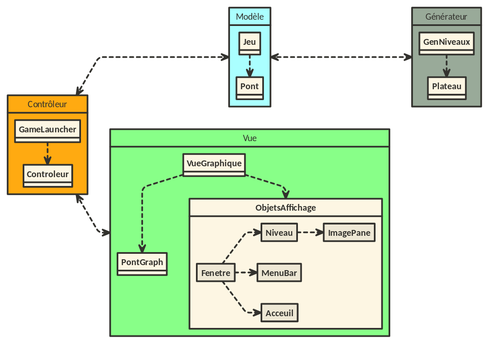

# Document explicatif du Projet

## Objectif du projet
  
L'objectif de ce projet est de recréer un jeu sur le modèle du jeu mobile Aquavias.  
D'où le nom Aquavias pour ce projet.  
C'est un jeu "d'énigme", dans lequel le joueur est face à un aqueduc en plusieurs morceau, qu'il doit reconstruire. Pour ce faire, sa seule possibilité 
est de faire tourner les différents morceaux de ponts qui sont positionnés dans le niveau.
Vous trouverez les instructions nécéssaires à l'exécution du jeu ainsi qu'une expliquation du principe et des fonctionnalités du jeu dans le fichier [README.md](../README.md) principal.

## Architecture du programme

### Format et sauvegarde des niveaux

Les niveaux sont sauvegardés dans des fichiers json.  
Le fichier json d'un niveau comprend 7 champs :  
  * `hauteur` et `largeur` qui définissent la taille du plateau.  
  * `mode` qui définit le mode de jeu utilisé pour ce niveau.  
  * `limite` et `compteur` qui définissent respectivement la limite de coups et le compteur initial lors du lancement du niveau.  
  * `difficulte` qui définit le niveau de difficulté estimé pour le niveau.  
  * `niveau` est une de tableaux représentant respectivement la matrice du niveau et le contenu de chaque case (qui contient un pont ou rien du tout).  
    * S'il y a un pont, une case est un tableau de 3 champs : le premier est le type du pont, le second est son orientation et le troisieme précise s'il s'agit d'un pont spécial (entrée ou sortie).  
    * S'il n'y a pas de pont, la case est représentée par un tableau vide.  

Lorsque l'on charge un niveau, le programme va chercher le fichier JSON correspondant à ce niveau.  
Grâce aux informations contenues dans ce fichier, le programme est capable de recréer une matrice de Ponts correspondant au niveau.  

### Formatage du code

Notre code suit l'architecture modèle - vue - controleur afin d'avoir une structure cohérente.  
Le schéma UML suivant décrit de façon globale cette architexture appliquée à notre programme :  
  

### Ponts

Un pont est défini par 5 attributs :  
  * Sa `forme` caractérisée par un char. I, L, T ou X.
  * Son `orientation` caractérisée par un char : E pour Est, N pour Nord, O pour Ouest et S pour Sud.  
  * Un tableau de booléens de taille 4, `sorties`, qui défini dans quelles directions le pont est ouvert, le tableau "sorties" suit l'organisation [Nord, Est, Sud, Ouest].  
  * Un booléen `eau` qui informe sur la présence d'eau ou non sur le pont.  
  * Une string, `spe`, valant null pour les ponts normaux et "entree" ou "sortie" pour les ponts correspondants.  

### Ponts Graphiques  
  
Chaque pont possède aussi une sous classe, PontXGraph, qui s'occupe de la partie graphique de chaque pont, afin de bien dissocier le modèle de la vue. Ainsi les
classes PontXGraph stockent simplement les images des différents ponts dans les différentes situations (rotation, avec ou sans eau, entrée ou sortie), et renvoit la bonne
version de l'image selon l'état actuel du pont.  
  
L'affichage se contentera donc de récuper l'image de chaque pont de la matrice et de l'afficher au bon endroit dans la fenêtre d'affichage.  

## Répartition du travail

Pour nous répartir le travail, nous avions une réunion hebdomadaire avec notre responsable de projet durant laquelle nous discutions des possibles améliorations du programme.  
Avant le confinement, nous avions des sprints de deux semaines durant lesquels nous avions un certains nombre d'issues à finir, séléctionnées au début du sprint.  
Pour chaque issue nous discutions entre les membres pour savoir qui allait la résoudre. Une branche (au minimum) était alors créée et allouée à la résolution de cette issue.  
Au fur et à mesure que nous avancions dans le projet nous rajoutions, dès que nous pouvions, nous aussi des issues dans liste à faire pour le sprint d'après.  
Nous avons beaucoup travaillé en groupe sur les issues qui nous semblaient plus importantes et longues comme la création du générateur de niveau.  
Lorsqu'une issue est résolue alors la personne chargée de celle-ci créé une "Merge Request" et l'assigne à un membre de l'équipe.  
Après approbation de ce membre désigné, la branche est fusionnée avec la branche indiquée, souvent la branche develop.  
  
## Pistes d'amélioration
  
Nous avons créé des issues contenant le tag [BONUS] dans leur titre pour chaque pistes d'améliorations que nous aurions aimé pouvoir implémenter.  
Voici la liste exhaustive des ces issues :  
*  Décoration de fond du niveau :  Cette issue à pour but de mettre une image en fond pour les niveaux.  
Nous avons commencé cette issue mais suite à quelques problèmes techniques, dont nous parlerons plus dans la partie "Difficultés rencontrées", nous avons mis en pause la résolution de cette issue.  
*  Proposer de générer un nouveau niveau après la fin d'un niveau générer : Le but serait ici de proposer directement de générer un nouveau niveau lorsque l'on finit le dernier niveau du jeu (même lorsue ce dernier niveau vient d'être généré).  
Cela éviterait à l'utilisateur de devoir retourner au menu puis cliquer sur le bouton `mode infini`.  
*  Menu Principal : Nous pensions faire ici un menu principal plus élaboré qui permettrait d'exploiter la taille de la fenêtre pour charger les niveaux ou faire d'autres actions plus basiques plutôt que d'afficher simplement une image.  
*  Meilleur affichage compteur : Nous aurions aimé faire un meilleur affichage pour le compteur de coups et la réserve d'eau, à l'image du jeu mobile Aquavias.  
*  ajout de sons : Afin de rendre le jeu plus agréable à jouer nous pensions ajouter des bruitages pour l'eau qui coule ou les ponts qui tournent. Nous avons aussi pensé à une musique de fond ou encore une musique de victoire.  
*  Changement graphisme : Nous pouvons facilement changer les images de chaque pont grâce au découpage des classes. Nous pensions donc passer sur des images plus détaillée et en perspectives pour un rendu en 3 dimensions.  
*  Ajout d'animations : Nous avons pensé à faire une animation plutôt que de faire un simple changement d'image lorsque l'on tourne un pont. L'eau qui coule pourrait aussi être faite en animation.  
*  Générique : Lorsque l'on finit les (20) niveaux de la version originale de notre jeu nous aurions aimé rajouter un petit générique pour marquer la fin du jeu (même si nous pouvons encore jouer grâce au mode infini).  
*  FrameWork d'internationnalisation : Notre chargé de TP nous a soufflé l'idée d'intégrer un framework d'internationnalisation pour avoir le jeu en plusieurs langues et également de laissé la liberté du genre utilisé au joueur.  
*  Faire des tests unitaires plus poussés : Nous n'avons pas écrit de vrais tests afin de prouver le fonctionnement du jeu et de l'algorithme de génération de niveau. Nous avons seulement écrit un petit test qui vérifie que le niveau 1 du jeu est bien chargé, et que le générateur de niveau ne renvoit pas d'erreur.  
Nous n'avons cependant pas eu le temps d'écrire des tests plus avancés pour tester, par exemple, que l'image d'un pont correspond bien à son modèle, que les niveaux exportés correspondent bien aux niveaux dans le modèle etc ...

## Difficultés rencontrées  
  
La première difficulté qui s'est présentée à nous a été la baisse d'effectif. En effet dès les premières semaines du projet seule la moitiée du groupe résolvait, en dehors des séances de TP ou nous travaillions tous ensemble, les issues assignées.  
Un membre a ensuite été incapable de pouvoir honorer les rendez vous hebdomadaires, à cause de problèmes personnels.  
Enfin le confinement est arrivé et seul le travail en dehors des cours était maintenant possible ce qui à accentué la différence de travail entre les deux motiés de l'équipe.  
  
Nous avons ensuite connus des problèmes causé par la programmation dite `Thread Safe`.  
En effet pour les éléments d'interface graphique nous utilisons l'instruction `EventQueue.invokeLater`.  
Or cela retarde de quelques millisecondes à une seconde les instructions qu'elle contient, produisant alors un écart entre l'execution du code qui est dedans et celui qui n'y est pas.  
Certains appels à des fonctions étaient donc effectués trop tôt par rapport à l'éxecution du code dans le `EventQueue.invokeLater` ce qui produit des erreurs car les valeurs obtenues sont alors érronées.  
Nous avons réussis à "contourner" ce problème en réduisant au maximum l'utilisation de `EventQueue.invokeLater` et en évitant de faire des appels immédiats sur des fonctions qui nécéssiteraient d'être dans ce `EventQueue.invokeLater`.  
  
La création de algorithme de génération de niveau a également été un obstacle important à surmonter. En effet nous devions faire un algorithme capable de créer plusieurs niveaux tous différents tout en nous assurant que le niveau soit finissable et un minimum agréable à faire.  
Nous avons finalement réussi à écrire un tel algorithme. Nous avons écrit plusieurs itérations de cet algorithme, avant d'arriver à un résultat fonctionnel et 
pas trop compliqué. Nous l'expliquons en détail dans le fichier [README.md](../GenNiveaux/README.md) du dossier GenNiveaux.  
  
La dernière difficultés que nous avons eu concerne l'ajout de l'image de fond pour chaque niveau. Nous avons réussi à mettre une image en fond sur les niveaux, mais 
nous avons alors fait face à plusieurs problèmes. En effet nous devons ajouter l'image de fond à chaque chargement de niveau ce qui produit ralentissement du programme, 
clignotement de la fenêtre et autres bugs graphiques.  
Nous avons donc décidé de laisser cette issue en piste d'amélioration car non essentielle au jeu. Nous n'avons pour le moment pas trouvé de moyen de régler ce problème.  